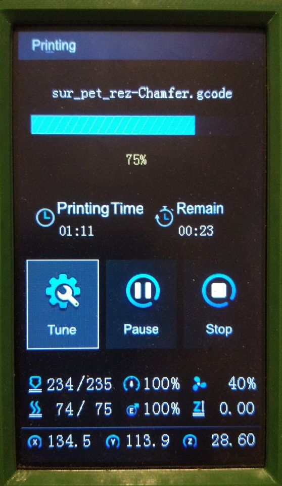
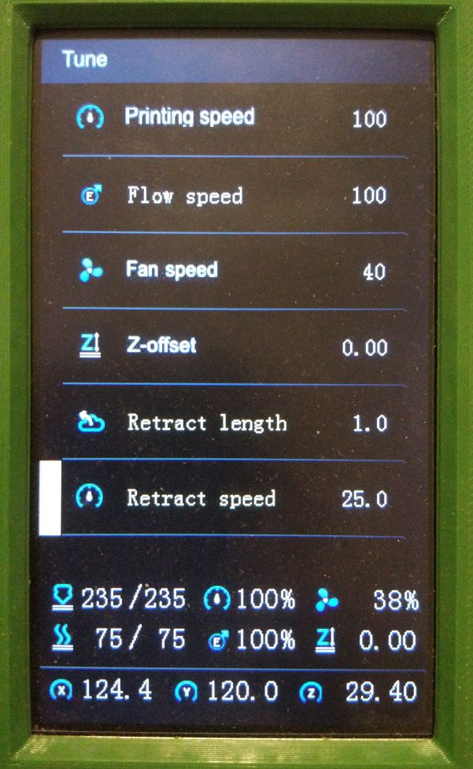

# DWIN_T5UIC1_LCD

Python class for the Ender 3 V2 LCD runing klipper3d with Moonraker for Orange Pi Zero 2 Board using OPi.GPIO

- https://www.klipper3d.org
- https://octoprint.org/
- https://github.com/arksine/moonraker

## 1. Setup:

### [Enabling Klipper's API socket](https://www.klipper3d.org/API_Server.html)
  Check your /etc/systemd/system/klipper.service file for API enable parameter `-a /tmp/klippy_uds`:

  `ExecStart=/home/pi/klippy-env/bin/python /home/pi/klipper/klippy/klippy.py /home/pi/klipper_config/printer.cfg -l /home/pi/klipper_logs/klippy.log -a /tmp/klippy_uds`

### 1.1 Library requirements 

  Thanks to [wolfstlkr](https://www.reddit.com/r/ender3v2/comments/mdtjvk/octoprint_klipper_v2_lcd/gspae7y)

  ```
  sudo apt-get install python3-pip python3-serial git
  sudo pip3 install multitimer
  sudo pip3 install OPi.GPIO
  git clone https://github.com/gabrielribbae/DWIN_T5UIC1_LCD.git
  ```

### 1.1.1 Important

To work with original repo, the RPi.GPIO library was replaced by [OPi.GPIO](https://github.com/rm-hull/OPi.GPIO). 

- You should clone OPi.GPIO repo from github and manually install it, or [install via pip](https://opi-gpio.readthedocs.io/en/latest/install.html) as stated in Lib requirements, and then add [zero2.py](https://github.com/rm-hull/OPi.GPIO/blob/master/orangepi/zero2.py) module into `install-dir/OPi.GPIO/orangepi`

<<<<<<< HEAD
- Check carefully where the package is installed as then interpreter need to know the directory in its path.
=======
### Wire the display 
  * Display <-> Raspberry Pi GPIO BCM
  * 1  - Nc
  * 2  - Nc
  * 3  - Rx   = 8  - GPIO14  (Tx)
  * 4  - Tx   = 10 - GPIO15  (Rx)
  * 5  - Ent  = 33 - GPIO13
  * 6  - BEEP = 31 - GPIO6 (Optional)
  * 7  - A    = 35 - GPIO19
  * 8  - B    = 37 - GPIO26
  * 9  - Vcc  = 4  - (5v)
  * 10 - Gnd  = 6  - (GND)
>>>>>>> b5055af842392453051d0e676bf273954ab09e28

- Also check permissions to call sysfs pin mappings as [non root access](https://opi-gpio.readthedocs.io/en/latest/install.html#non-root-access)

### 1.2 Wire the display 
  * Display <-> Orange Pi Zero 2 GPIO
  * Rx  =   Pin 8  (UART5 Tx - PH2) <-- Orange
  * Tx  =   Pin 10  (UART5 Rx - PH3) <-- Yellow
  * Ent =   Pin 15 (PC8) <-- Green
  * A   =   Pin 11 (PC6) <-- Gray
  * B   =   Pin 13 (PC5) <-- Purple
  * Vcc =   Pin 2   (5V) <-- Black
  * Gnd =   Pin 4   (GND) <-- White

Here's a diagram based on color selection as stated above:


### 1.3 Run The Code

Enter the downloaded DWIN_T5UIC1_LCD folder.
Run with `python3 ./run.py`

### 1.4 Run at boot:

Note: Delay of 30s after boot to allow webservices to settal. Path of `run.py` is expected to be `/home/pi/DWIN_T5UIC1_LCD/run.py`
Modify service to point where is the run.py path. By default was set to USER env var.

   ```
   sudo chmod +x run.py
   sudo chmod +x simpleLCD.service
   sudo mv simpleLCD.service /lib/systemd/system/simpleLCD.service
   sudo chmod 644 /lib/systemd/system/simpleLCD.service
   sudo systemctl daemon-reload
   sudo systemctl enable simpleLCD.service
   sudo reboot
   ```
## 2. Status

<<<<<<< HEAD
### 2.1 Working

 Print Menu:
 
    * List / Print jobs from OctoPrint / Moonraker
    * Auto swiching from to Print Menu on job start / end.
    * Display Print time, Progress, Temps, and Job name.
    * Pause / Resume / Cancle Job
    * Tune Menu: Print speed & Temps

 Perpare Menu:
 
    * Move / Jog toolhead
    * Disable stepper
    * Auto Home
    * Z offset (PROBE_CALIBRATE)
    * Preheat
    * cooldown
 
 Info Menu:
 
    * Shows printer info.

### 2.2 Not working
=======
## Notworking:
>>>>>>> b5055af842392453051d0e676bf273954ab09e28
    * Save / Loding Preheat setting, hardcode on start can be changed in menu but will not retane on restart.
    * The Control: Motion Menu
